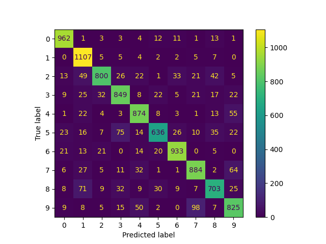

Linear regression learning for MMN11

Results:

<h3>Results: </h3> 

Accuracy: 0.2316

The results of the algorithm are mostly consistent (~0.2 accuracy) in every run even though the test and example cases are selected randomly every time.

The overall results are much worse than the Perceptron model's results, but while the Perceptron's miscalssifications are spread evenly across all classes the Linear Regression's miscalssifications are mostly around the classes "nearer" the actual class - this is because Linear Regression regards the classes as actual numbers - locations on a grid and the Perceptron regards them as tags that could be any other string. 