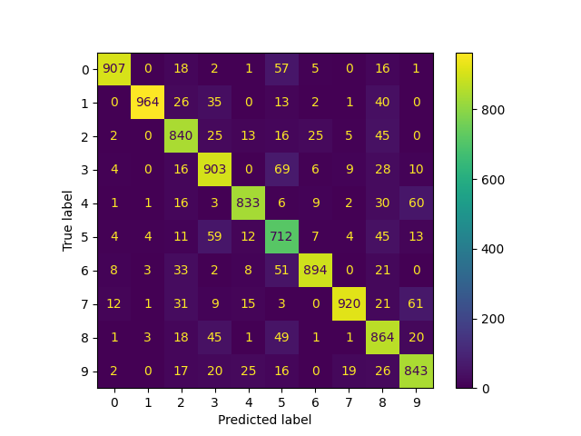

Perceptron learning for MMN11

Results:
(Image may change after each run, updated accuracy and sensitivity are printed in console)

<h3>Results after a 10 iterations run: </h3> 

Accuracy: 0.5218

Sensitivity per class:
* Class 0: 0.87
* Class 1: 0.93
* Class 2: 0.19
* Class 3: 0.64
* Class 4: 0.88
* Class 5: 0.25
* Class 6: 0.72
* Class 7: 0.54
* Class 8: 0.00
* Class 9: 0.17

<h3>Results after a 50 iterations run: </h3> 

Accuracy: 0.7731

Sensitivity per class:
* Class 0: 0.95
* Class 1: 0.97
* Class 2: 0.70
* Class 3: 0.71
* Class 4: 0.89
* Class 5: 0.67
* Class 6: 0.90
* Class 7: 0.87
* Class 8: 0.34
* Class 9: 0.68

The results of the algorithm improve the more iterations it runs - we can see that the accuracy after 50 iterations is about 25% better than the accuracy after only 10 iterations, but even after only 10 iterations the majority of the examples are labeled correctly.

We can see that some digits are much more sensitive than others, possibly due to the randomly chosen initial weight vectors, the misclassified example chosen for each iteration and the random distibution of labels between the test data and the training data.