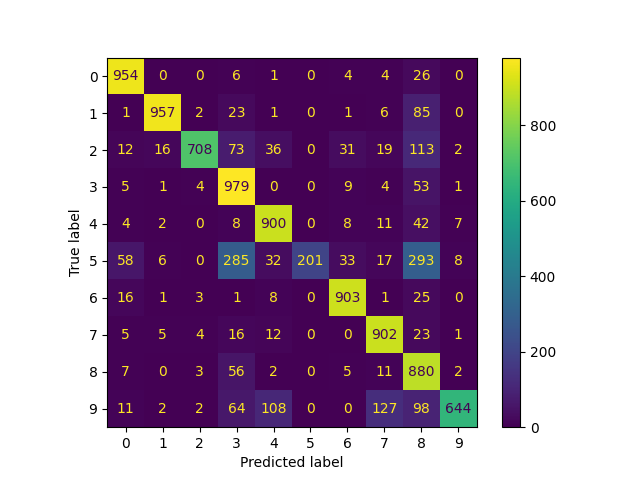

Softmax Regression learning for MMN11

Results:

<h3>Results after a 50 iterations run: </h3> 

Accuracy: 0.8028

Sensitivity per class:
* Class 0: 0.96
* Class 1: 0.89
* Class 2: 0.70
* Class 3: 0.93
* Class 4: 0.92
* Class 5: 0.22
* Class 6: 0.94
* Class 7: 0.93
* Class 8: 0.91
* Class 9: 0.61

